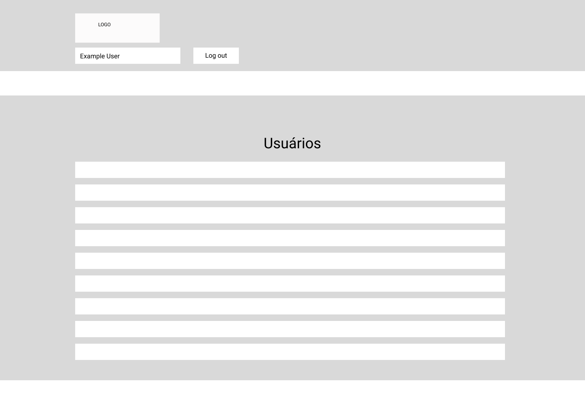

# Projeto de Interface
*Fluxo usuário*

*Fluxo administrador*

O projeto busca atender as expectivas do usuário de maneira simples e dinamica, onde o foco é simplesmente a notícia. Mantando uma interface limpa e responsiva ao desktop e dispositivos móveis.

## User Flow

## Wireframes

Conforme o fluxo do usuário apresentado no item anterior, a interface é dividida em duas grandes partes:

- Cabeçalho - Local onde encontramos a logo e o menu de navegação principal;
- Conteúdo - Local onde encontramos da tela em questão.

### Tela Home Page

Tela principal onde o usuário encontrará as últimas notícias postadas. Porém o usuário somente conseguirá postar alguma notícia depois de fazer seu log in.

### Tela de log in

Tela onde o usuário fará seu log in no site ou caso ainda não o tenha, criará um novo usuário.

### Tela de Administrador

Tela onde o administrador irá gerenciar os usuários.

### Tela de novo usuário

Tela onde o usuário irá se cadastrar, caso ainda não seja cadastrado.

### Tela Home com usuário ativo

Tela que terá o cabelhado alterado após o usuário realizar seu log in no site.

### Tela para nova notícia

Tela onde o usuário depois de ter realizado seu log in no site terá acesso e poderá enviar sua nótica para o portal.

### Tela Home com nova notícia

Tela final onde a nóticia que o usuário enviou e foi aceita será exibida.

